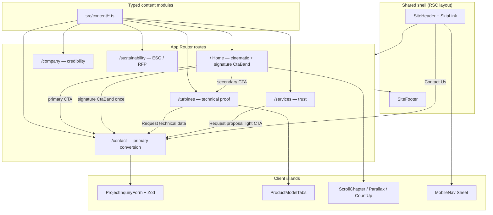

# Nordex Super Energies — Enterprise Web Reengineering Design

| Field | Value |
|-------|--------|
| **Document** | Phase 1 canonical design |
| **Author** | _TBD_ |
| **Date** | 2026-07-11 (revised) |
| **Status** | v1.1.1 — Approved for PR1–PR8; brand (Q1) deferred; PR9 + public deploy frozen until brand decision |
| **Scope root** | `F:\Projects\Ray-studio Creations\Nordex Super Energies` |
| **Authoring mode** | Approach 1 — Typed content modules + Next.js App Router |
| **Revision** | v1.1.2 — user brand decision: proceed structure only; defer brand (PR9 / public deploy frozen) |

---

## Overview

Nordex Super Energies today is a broken static dump: misnamed assets at the project root, no design system, no multi-route product structure, and no reliable pipeline for marketing content or lead conversion. Phase 1 reengineers that dump into an **enterprise-grade multi-route marketing product** under the same folder: Next.js App Router (current stable at scaffold time, target 15.x+), Tailwind v4 tokens, shadcn/ui (new-york / Radix), six routes, an Arctic Trust visual system, cinematic motion on flagship chapters only, and a client-side project-inquiry form whose primary job is qualified lead generation.

This document is the **canonical Phase 1 design**. It folds the v1.1 design-critique improvements and the subsequent design-review corrections (full legacy turbine `specsData`, honest stub success copy, signature-band ownership, form abuse edge cases, PR dependency hygiene, deploy defaults) into definitive prose.

**User decision (final):** **Proceed structure only; defer brand.** PR1–PR8 may implement using current draft brand strings. **PR9 (Figma)** and any **public deployment** stay frozen until the user later chooses keep-as-is vs rename. Collision-adjacent artifacts remain draft placeholders, not final legal brand.

---

## Background & Motivation

### Current state (verified at scope root)

| File / path | Reality (magic / content) |
|-------------|---------------------------|
| `index (2).css` | Full HTML marketing page (misnamed; starts with `<!DOCTYPE html>`; 35 171 bytes) |
| `index (2).html` | JPEG image (misnamed; magic `FF D8 FF`; 876 193 bytes) |
| `wind_farm_hero.jpg` | Hero photo loose at root (magic `FF D8 FF`; 475 442 bytes) |
| `index.css` | Missing — page is unstyled if opened “as intended” |
| `assets/wind_turbine_product.jpg` | **Referenced in legacy HTML; not present on disk** |
| Tooling dirs (optional cleanup) | `.superpowers/`, `.codebase-memory/`, `.qodo/`, `Nordex Super Energies.code-workspace` |

There is no App Router app, no shared shell, no accessible component library, no typed content model, and no asset pipeline under `public/`. Business intent is a platform-marketing-quality surface (craft comparable to Apple / Microsoft / Android product marketing): deliberate tokens, accessibility, scoped motion, lead conversion, and a Figma system mirror at Phase 1 end.

### Naming note (structure unblocked; brand deferred)

“Nordex” is also the name of an existing, publicly traded German wind turbine manufacturer (Nordex SE) in the same category (onshore turbines, roughly 4–7 MW class).

**User decision (final):** **Proceed structure only; defer brand.**

| Unblocked now | Frozen until keep-vs-rename decision |
|---------------|--------------------------------------|
| PR1–PR8 implementation with **current draft brand strings** (Nordex Super Energies; legacy HQ/email/domain/SE copyright as placeholders) | **PR9 (Figma system mirror)** |
| Internal / non-public builds and review URLs as needed for engineering | **Any public deployment** presenting brand as final |

**Collision-adjacent draft artifacts** (placeholders only — not final legal brand; revisit before PR9/public): legacy copyright “NORDEX SUPER ENERGIES **SE**”; OG URL / implied domain `nordex-super-energies.com`; contact email `info@nordex-super-energies.com`. Do not invent a rename in code; swap strings in one place (`site.ts`) if rename is chosen later.

### Pain points this design addresses

1. **Broken source of truth** — misnamed files cannot be maintained or deployed.
2. **No product IA** — single legacy page cannot grow SEO routes or a conversion funnel.
3. **No design system** — ad-hoc “eco AI landing” look; no tokens, type scale, elevation, or motion discipline.
4. **No conversion system** — form markup without validation, pending UX, spam heuristics, or a stub upgrade path.
5. **Unverified a11y / performance** — contrast, LCP budget, and reduced-motion were not locked.

---

## Goals & Non-Goals

### Goals (Phase 1)

1. **Ship a Next.js App Router product site** under the project folder only (current stable App Router at scaffold time; **target 15.x+**).
2. **Six routes:** Home, Turbines, Services, Company, Sustainability, Contact.
3. **Arctic Trust** visual system (light, institutional, deep teal) via Tailwind v4 tokens + shadcn/ui.
4. **Cinematic storytelling motion** on flagship surfaces (Home, Turbines); quiet chrome elsewhere. CSS-first; Framer Motion only if CSS cannot deliver a chapter effect.
5. **Primary job: qualified project leads** — persistent Contact CTA + full inquiry form UX (validation, pending, honest success, abuse heuristics).
6. **Polish existing copy** into typed content modules (do not invent unvalidated technical claims **beyond** what exists in legacy HTML/JS).
7. **Figma design system mirror** after UI stabilizes (tokens + Home / Turbines / Contact frames) — **PR9 frozen** until brand keep-vs-rename decision.
8. **Fix legacy structure** — correct filenames, assets only under `public/assets/`, archive then remove obsolete roots.
9. **Lock craft bar** — contrast re-verification, performance budget, browser support matrix, event taxonomy (provider wiring Phase 2).

### Non-goals (Phase 1)

- Headless CMS (Sanity, etc.)
- CRM / email provider / real form API persistence
- i18n / multi-locale
- Auth / customer portal
- Hyperframes promo film render (Phase 2 asset; motion principles may inform web)
- Android / iOS native apps
- Full analytics platform (Phase 1 defines an **event taxonomy** only; wiring a provider is Phase 2)
- Inventing turbine specs, certifications, or legal entities **beyond** legacy HTML/JS (including the `specsData` object) — preserve what is there; mark only truly absent fields as optional
- Static export as the default deploy mode (preserves future `/api/inquiry` path; see Architecture)
- `mailto:` as the Phase 1 form stub (puts PII into the local mail client)

---

## Key Decisions

Locked brainstorm decisions plus critique- and review-resolved decisions. Each row names the rejected alternative.

| Decision | Choice | Rejected alternative | Why |
|----------|--------|----------------------|-----|
| Product form | Next.js + React + Tailwind v4 + shadcn (new-york / Radix); **current stable App Router at scaffold (target 15.x+)** | Static zero-build HTML/CSS only | Multi-route product needs components, tokens, a11y primitives, and a maintainable App Router layout |
| Deploy default | **Vercel with default Next.js Node/server runtime** (not `output: 'export'`) | Static export day one | Keeps upgrade path for `POST /api/inquiry` without re-architecting |
| Information architecture | Multi-route product site (six routes) | Cinematic one-pager | SEO, growth room, corporate product feel |
| Visual language | **Arctic Trust** (light institutional) | Midnight Engineering; Kinetic Horizon | Boardroom trust + content-first marketing; still supports teal brand |
| Motion | **Cinematic storytelling** (scoped); **CSS-first**, optional `framer-motion` only if needed | Quiet-only; measured-only; Framer on every surface | User-selected; flagship chapters perform; chrome stays calm; protects JS budget |
| Primary job | **Qualified project leads** | Tech-proof first; brand-story first; balanced | Conversion is north star; other pages support trust |
| Content | **Polish existing** (HTML **and** inline JS data) | Full rewrite; placeholders; drop JS-only specs | Legacy draft has product substance in markup *and* `specsData` |
| Phase 1 scope | **Web + Figma system** | Web only; full suite + Hyperframes film | Design-system claim without diluting web polish |
| Implementation approach | **Typed content modules + App Router** | MDX-first; CMS day one | Type-safe, fast, CMS-ready structure without CMS ops |
| Form backend | Client validation + **honest in-browser success stub** | Real CRM day one; `mailto:` stub | YAGNI; no false “transmitted” claims; no PII in mail client |
| Fonts | **Geist Sans** + **Geist Mono** | Inter-only; system stack | Institutional UI + mono metrics; literal families in `@theme inline` (no circular `var(--font-sans)`) |
| Home CTAs | Primary **Contact / Request proposal** → `/contact`; secondary **Our turbines** → `/turbines` | Legacy order (Turbines primary / Learn more secondary) | Lead-gen first, proof path second — **intentional flip** from legacy |
| Section rhythm | **One signature deep-teal band** = shared `CtaBand` rendered **once on Home** (mid-funnel, after services teaser) | Sustainability full-page dark chrome; multiple dark bands; dual “or” placement | Single owner component; Services/Turbines link to `/contact` with light CTAs; FAQ/footer stay light |
| Form abuse protection | Honeypot + time-trap (**timer starts on first field focus**, threshold **3s**), client-side only | No protection; viewport-entry 1.5s timer | Zero new deps; fewer power-user false positives; still catches dumb bots |

---

## Proposed Design

### Architecture

#### Stack

| Layer | Choice |
|-------|--------|
| Framework | Next.js **current stable App Router at scaffold time (target 15.x+)**, TypeScript, React Server Components by default |
| Deploy | **Vercel Node / default Next server** (not static export in Phase 1) |
| Styling | Tailwind CSS v4, CSS-first `@theme` / `@theme inline` tokens |
| Components | shadcn/ui (`new-york`, Radix base), `npx shadcn@latest init -d --base radix` |
| Validation | Zod (+ optional react-hook-form if form complexity warrants) |
| Icons | Lucide (`h-4 w-4` / `h-5 w-5` consistent) |
| Fonts | **Geist Sans** (UI/body/display) + **Geist Mono** (metrics/specs). Literal family names in `@theme inline`. Fallback only if install fails: Inter + JetBrains Mono |
| Motion | **CSS + View Transitions first**; `framer-motion` is an **optional** Phase 1 dependency — add only if parallax/pin cannot be done in CSS; load motion islands via `dynamic(() => import(...), { ssr: false })` or equivalent |
| Content | Typed TS modules in `src/content/*` |
| Images | `next/image` everywhere; no raw `` for content images |
| SEO files | `app/robots.ts` + `app/sitemap.ts` (placeholder base URL until domain known) |
| Design handoff | Figma generate after UI (Phase 1 end) |

#### Target directory layout

```text
Nordex Super Energies/
  package.json
  next.config.ts
  tsconfig.json
  components.json
  .gitignore
  _legacy/                     # PR2 archive only; deleted in PR10
    source.html                # from misnamed index (2).css
  public/
    assets/
      wind_farm_hero.jpg
      wind_farm_aerial.jpg     # from misnamed index (2).html JPEG
      # wind_turbine_product.jpg intentionally omitted until rights/asset exist
  src/
    app/
      layout.tsx
      page.tsx                 # Home
      globals.css              # @import "tailwindcss"; @theme tokens
      robots.ts
      sitemap.ts
      turbines/page.tsx
      services/page.tsx
      company/page.tsx
      sustainability/page.tsx
      contact/page.tsx
      not-found.tsx
      error.tsx
    components/
      ui/                      # shadcn primitives only
      layout/                  # SiteHeader, SiteFooter, MobileNav, SkipLink
      marketing/               # HeroCinematic, StatGrid, SectionIntro, CtaBand (signature), …
      forms/                   # ProjectInquiryForm
      motion/                  # ScrollChapter, ParallaxMedia, CountUp, PageTransition
    content/
      site.ts
      home.ts
      turbines.ts
      services.ts
      company.ts
      sustainability.ts
      contact.ts
      faq.ts
      types.ts
    lib/
      utils.ts                 # cn()
      validations/inquiry.ts
      analytics.ts             # typed event-fire helper (console-only Phase 1); no PII props
  docs/
    superpowers/specs/         # this document
  .superpowers/                # brainstorm session (gitignore)
```

#### Runtime shape

```text
Browser
  └── Next.js App Router (Vercel Node / default server)
        ├── RSC pages compose content modules
        ├── Client islands: form, tabs, cinematic motion (dynamically imported), mobile sheet
        └── Static assets from /public/assets
```

No server actions required for Phase 1 form submit (in-browser stub only). Future: `POST /api/inquiry` without redesigning form fields — **requires non-export deploy mode**.

#### Architecture & funnel diagram



#### Routing and funnel

| Route | Purpose | Funnel role | Section inventory (legacy-derived only; no new claims) |
|-------|---------|-------------|--------------------------------------------------------|
| `/` | Cinematic brand + proof teaser | Attention → soft CTA | Hero (inverted CTAs) → stats teaser → services teaser → **signature `CtaBand` (once site-wide)** → optional light FAQ teaser |
| `/turbines` | Models, specs, features | Technical proof → “Request technical data” | Section intro → model tabs + specs table (full `specsData`) → feature bullets from legacy → light CTA to `/contact` |
| `/services` | EPC, development, O&M | Trust → proposal CTA | Section intro → three service cards (turnkey / development / servicing) → light CTA to `/contact` (**not** a second dark band) |
| `/company` | Stats, credibility | Credibility | About paragraph (“four decades…”) → full StatGrid → optional FAQ accordion (light surface, not dark) |
| `/sustainability` | Circular design, net-zero story | RFP / ESG buyers | Intro + four pillars from legacy (recyclable blades, low-carbon concrete, hybrid wood-steel, net-zero 2030) — **light page**, no signature band |
| `/contact` | **Primary conversion** | Inquiry form | Intro + HQ/email draft strings → ProjectInquiryForm → success panel |

**Global:** SiteHeader CTA always → `/contact`. Footer mirrors nav + legal placeholders (`Legal Notice`, `Privacy Policy`, `Cookies` as `#` or stub routes until real copy exists).

**Invariant:** `--color-signature-bg` appears only inside the Home mid-funnel `CtaBand`. At most one instance site-wide. Services and other routes may *link* to `/contact` with light CTAs; they must not re-render the dark band.

#### Performance budget

| Metric | Target | Lever |
|--------|--------|-------|
| LCP | &lt; 2.5s (simulated 4G, mobile) | `next/image priority` on hero; AVIF/WebP; explicit width/height to avoid CLS |
| Total hero image weight | &lt; 180 KB served (down from ~475 KB source JPEG) | Next.js image pipeline, quality 75–80, responsive `sizes` |
| JS shipped to client (Home route) | &lt; 150 KB gzipped for interactive islands | RSC default; **dynamic-import** motion islands; prefer CSS motion over Framer; form not required on Home |
| CLS | &lt; 0.1 | Reserve space for hero media, stat cards, and lazy sections before load |
| Font loading | No FOIT | `next/font` with Geist, `display: swap` |

Lighthouse (mobile, throttled) gates on Phase 1 done: Performance ≥ 90, Accessibility ≥ 95, Best Practices ≥ 95, SEO 100 (includes `robots` / `sitemap` presence).

---

### Design system — Arctic Trust

#### Token hierarchy

```text
Brand (abstract) → Semantic (purpose) → Component (shadcn maps semantic)
```

Use **OKLCH** for semantic colors where practical; hex below are intent anchors for Figma/docs.

| Token | Intent | Anchor |
|-------|--------|--------|
| `--color-background` | Page | `#f8fafc` / oklch light slate |
| `--color-foreground` | Primary text | `#0f172a` |
| `--color-card` | Surfaces | `#ffffff` |
| `--color-primary` | Brand actions | `#0f766e` (teal-700) |
| `--color-primary-foreground` | On primary | `#ffffff` |
| `--color-muted` | Subtle fills | `#f1f5f9` |
| `--color-muted-foreground` | Secondary text | `#475569` (slate-600; upgraded from slate-500 for contrast margin) |
| `--color-accent` | Soft brand wash | `#ccfbf1` / teal-100 |
| `--color-border` | Hairlines | `#e2e8f0` |
| `--color-ring` | Focus | primary-aligned |
| `--radius` | Institutional | `0.625rem`–`0.75rem` |
| `--color-signature-bg` | The one deep-teal band (`CtaBand` only) | `#0b3b36` (teal-950-ish, custom) |
| `--color-signature-foreground` | Text on signature band | `#f0fdfa` |

**Rules:**

- Foundational surfaces use tokens (`bg-background`, `bg-card`, `text-muted-foreground`) — no ad-hoc palette sprawl.
- One accent family (teal). No rainbow gradients on chrome.
- Density: comfortable on marketing pages (`gap-6` / `p-6` / `text-sm`–`base`).
- Specs tables: tabular nums + mono for unit values where helpful.
- The signature dark band is the **only** place `--color-signature-bg` is used. Hard invariant: **one render site-wide** (Home `CtaBand`).

#### Color contrast verification

Computed against WCAG 2.2 relative luminance (sRGB hex anchors). Treat as approximate until re-measured on rendered (anti-aliased) pixels:

| Pair | Ratio (sRGB recompute) | Result |
|------|------------------------|--------|
| `--color-primary` `#0f766e` on `--color-card` `#ffffff` | **≈ 5.47 : 1** | Passes AA normal text with margin. Do not lighten this value. |
| `--color-muted-foreground` old slate-500 `#64748b` on `#f8fafc` | **≈ 4.55 : 1** | Passed AA but no margin — **upgraded to slate-600** |
| `--color-muted-foreground` slate-600 `#475569` on `#f8fafc` | **≈ 7.24 : 1** | Passes AA with comfortable margin |
| `--color-signature-foreground` `#f0fdfa` on `--color-signature-bg` `#0b3b36` | **≈ 11.9 : 1** | Passes AAA |

Re-verify all pairs once fonts and final hex/oklch values are rendered — OKLCH interpolation can drift slightly from sRGB hex.

#### Type scale

Geist Sans unless noted. All sizes fluid (`clamp()`) between the mobile and desktop values shown.

| Level | Mobile | Desktop | Line-height | Tracking | Weight | Use |
|-------|--------|---------|-------------|----------|--------|-----|
| Display | 2.25rem / 36px | 4rem / 64px | 1.05 | -0.02em | 600 | Home hero H1 only |
| H1 | 1.875rem / 30px | 2.75rem / 44px | 1.1 | -0.01em | 600 | Page titles |
| H2 | 1.5rem / 24px | 2rem / 32px | 1.2 | -0.01em | 600 | Section headers |
| H3 | 1.25rem / 20px | 1.5rem / 24px | 1.3 | 0 | 600 | Card/subsection titles |
| Body | 1rem / 16px | 1.0625rem / 17px | 1.6 | 0 | 400 | Paragraph copy |
| Small | 0.875rem / 14px | 0.875rem / 14px | 1.5 | 0 | 400 | Labels, captions, footer |
| Mono (specs) | 0.875rem / 14px | 0.9375rem / 15px | 1.4 | 0 | 500 | Geist Mono — spec tables, stat values |

Max line length: `65ch` for body paragraphs; specs tables exempt.

#### Elevation & layering

| Token | Value | Use |
|-------|--------|-----|
| `--shadow-sm` | `0 1px 2px rgb(15 23 42 / 0.06)` | Cards at rest |
| `--shadow-md` | `0 4px 12px rgb(15 23 42 / 0.08)` | Cards on hover, header once scrolled |
| `--shadow-lg` | `0 12px 32px rgb(15 23 42 / 0.12)` | Sheet, popovers, signature-band content card |

| z-index | Layer |
|---------|--------|
| 0 | Page content |
| 10 | Sticky header |
| 20 | Mobile Sheet overlay |
| 30 | Toasts / Alert (if global) |
| 40 | Skip link (on focus only) |

#### Motion tokens

| Token | Value | Use |
|-------|--------|-----|
| `--duration-instant` | 100ms | Focus rings, active press |
| `--duration-fast` | 180ms | Button/link hover, tab switch |
| `--duration-base` | 300ms | Sheet open/close, card reveal |
| `--duration-cinematic` | 600–900ms | Hero parallax settle, chapter reveal |
| `--ease-standard` | `cubic-bezier(0.4, 0, 0.2, 1)` | Default UI motion |
| `--ease-emphasized` | `cubic-bezier(0.2, 0, 0, 1)` | Cinematic chapter entrances only |

All tokens collapse to `transition: none` / instant opacity swap under `prefers-reduced-motion: reduce` — no exceptions, including the signature band’s entrance.

#### Component states

Minimum required interactive states — explicitly verified against Arctic Trust tokens:

| Component | Default | Hover | Focus-visible | Active | Disabled |
|-----------|---------|-------|---------------|--------|----------|
| Button (primary) | `bg-primary` | `bg-primary/90` + `shadow-md` | 2px `--color-ring` offset ring | `bg-primary/85` scale-[0.98] | `opacity-50 pointer-events-none` |
| Input/Textarea | `border-border` | — | `border-primary` + ring | — | `bg-muted opacity-60` |
| Nav link | `text-foreground` | `text-primary` | ring on link box | — | n/a |

#### shadcn primitives (Phase 1 install set)

```bash
npx shadcn@latest init -d --base radix
npx shadcn@latest add button card input textarea label tabs accordion sheet separator badge skeleton alert
```

| Primitive | Usage |
|-----------|--------|
| Button | Primary/secondary CTAs |
| Card | Service cards, stat shells, form container |
| Input / Textarea / Label | Inquiry form |
| Tabs | Turbine models |
| Accordion | FAQ |
| Sheet | Mobile navigation |
| Separator | Header / footer structure |
| Badge | Tags, IEC class chips |
| Skeleton | Optional loading polish; missing product media |
| Alert | Form / page-level messages |

**Composition anti-patterns (forbidden):** raw `button`/`input` when primitives exist; nested cards thrice deep; glassmorphism on every surface; Dialog for destructive (N/A Phase 1).

#### Component layers

1. **`ui/*`** — shadcn only, lightly themed via tokens  
2. **`layout/*`** — SiteHeader, SiteFooter, MobileNav (Sheet), SkipLink  
3. **`marketing/*`** — HeroCinematic, StatGrid, SectionIntro, ProductModelTabs, ServiceCards, FaqAccordion, **CtaBand (signature owner)**, TrustStrip  
4. **`forms/*`** — ProjectInquiryForm  
5. **`motion/*`** — ScrollChapter, ParallaxMedia, CountUp, RouteTransition (dynamic-imported where heavy)

**`CtaBand` ownership rule:** only `src/app/page.tsx` (Home) imports and renders the signature variant (`variant="signature"` or equivalent using `--color-signature-bg`). Other pages may use a light `CtaBand` or plain Button CTA, never the signature surface.

---

### Content model

Content is **data, not pages**. Pages compose modules.

#### Types (conceptual)

```ts
// src/content/types.ts (illustrative)
export type PageMeta = {
  title: string
  description: string
  ogImage?: string
}

export type NavItem = { label: string; href: string }

export type Stat = {
  id: string
  value: string // "40+", "4-7 MW"
  label: string
}

export type TurbineModel = {
  id: "n149" | "n163" | "n175"
  name: string
  ratedPowerKw: number
  rotorDiameterM: number
  sweptAreaM2: number // required — present for all three in legacy specsData
  iecClass: string // required — present for all three in legacy specsData
  features: { title: string; description: string }[] // may be sparse if legacy lacks per-model features
}

export type Service = {
  id: string
  title: string
  summary: string
  // emoji icons from legacy replaced with Lucide names
  icon: "building-2" | "map" | "wrench" // etc.
}

export type FaqItem = {
  id: string
  question: string
  answer: string
}

export type SiteConfig = {
  brandName: string
  tagline: string
  nav: NavItem[]
  footer: {
    columns: { title: string; links: NavItem[] }[]
    copyright: string // draft placeholder for PR1–PR8; final keep-vs-rename before PR9/public
    legalLinks: NavItem[] // Legal Notice, Privacy Policy, Cookies → "#" until copy exists
  }
  contact: { email: string; hq: string }
  defaultMeta: PageMeta
}
```

#### Source content mapping (legacy → modules)

Extract from misnamed HTML (`index (2).css`), including **inline JS** (`specsData`):

| Legacy section | Module / route |
|----------------|----------------|
| Hero | `home.ts` → `/` |
| Stats (40+, 4–7 MW, 380+, 30+) | `company.ts` + home teaser |
| Product tabs + `specsData` N149/N163/N175 | `turbines.ts` → `/turbines` |
| Services (turnkey, development, servicing) | `services.ts` |
| Sustainability | `sustainability.ts` |
| FAQ | `faq.ts` (shared; Company and/or Home teaser) — light surface only |
| Contact form + HQ/email | `contact.ts` + `site.ts` |

**Copy policy:** polish clarity and lead-gen CTAs; do **not invent beyond** legacy HTML/JS (markup *and* script objects). Do not invent certifications, MW installed totals, or legal entities beyond draft text. Brand name treated as client fiction unless legal assets supplied.

**Hero CTA order** is **intentionally inverted** from legacy for the qualified-leads job:

| | Legacy | Phase 1 (this design) |
|--|--------|------------------------|
| Primary | “Our Turbines” → products | **Contact / Request proposal** → `/contact` |
| Secondary | “Learn More” → about | **Our turbines** → `/turbines` |

Extractors must not “preserve” the legacy CTA order when it conflicts with this Key Decision.

#### Preserved turbine data (canonical = legacy `specsData`)

Source of truth — quote from `index (2).css` product-switching logic:

```js
// legacy specsData (canonical for turbines.ts)
n149: { power: "4,500 kW", rotor: "149 m", area: "17,437 m²", class: "IEC S (Medium / High)" },
n163: { power: "5,700 kW", rotor: "163 m", area: "20,867 m²", class: "IEC S (Medium / Low)" },
n175: { power: "6,800 kW", rotor: "175 m", area: "24,053 m²", class: "IEC S (Low Wind)" }
```

| Model | Rated power | Rotor diameter | Swept area | IEC class | Source |
|-------|-------------|----------------|------------|-----------|--------|
| N149 | 4,500 kW | 149 m | 17,437 m² | IEC S (Medium / High) | `specsData.n149` + tab “N149 / 4.5 MW” |
| N163 | 5,700 kW | 163 m | 20,867 m² | IEC S (Medium / Low) | `specsData.n163` + tab “N163 / 5.7 MW” |
| N175 | 6,800 kW | 175 m | 24,053 m² | IEC S (Low Wind) | `specsData.n175` + tab “N175 / 6.8 MW” |

All four numeric/class fields are **required** in `turbines.ts` for each model. Optional only for fields truly absent (e.g. richer per-model feature lists, product photography). **Do not drop JS-only values** that were previously mis-labeled TBD.

#### Preserved site contact & legal draft strings

| Field | Draft value (carry into `site.ts`) | Note |
|-------|-------------------------------------|------|
| HQ line | `Hamburg & Legal Register: Rostock, Germany` | Draft imprint; Open Q #4 may refine |
| Email | `info@nordex-super-energies.com` | Collision-adjacent domain; Open Q #1 |
| Copyright | `© 2026 NORDEX SUPER ENERGIES SE. All rights reserved.` | Draft placeholder for PR1–PR8; “SE” collision-adjacent; final keep-vs-rename before PR9/public |
| Legal links | Legal Notice, Privacy Policy, Cookies | Legacy `#` placeholders — keep as stubs, do not invent policy copy |
| OG URL (legacy) | `https://nordex-super-energies.com` | Placeholder until production domain known (Open Q #2) |

#### Product media strategy

| Asset | Status | Phase 1 strategy |
|-------|--------|------------------|
| `wind_farm_hero.jpg` | Present at root | Move to `public/assets/`; hero LCP candidate |
| Misnamed JPEG (`index (2).html`) | Present | Save as `public/assets/wind_farm_aerial.jpg` |
| `assets/wind_turbine_product.jpg` | **Missing** | Do **not** invent a diagram. Turbines page: omit product media **or** use aerial crop as decorative secondary media with accurate alt, **or** Skeleton placeholder. Prefer omit until Open Q #3 / rights |

#### Stats & sustainability copy (preserved intent)

| Stat | Value | Label |
|------|-------|--------|
| Experience | 40+ | Years of Technology Experience |
| Power class | 4–7 MW | Turbine Power Class Portfolio |
| Service points | 380+ | Global After-Sales Service Points |
| Countries | 30+ | Active Operational Countries |

Sustainability pillars for `sustainability.ts`: circular/recyclable rotor blade R&D, low-carbon concrete tower formulations, hybrid wood-steel assemblies, net-zero manufacturing target (nacelle + tower fabrication sites) by 2030.

---

### Lead form (conversion)

#### Fields

| Field | Type | Rules (normative Zod) |
|-------|------|------------------------|
| Full name | text | required, `min(2)` |
| Email | email | required, valid email |
| Company | text | required, `min(1)` |
| Planned capacity | range 10–500 MW, step 10 | required, default `50` |
| Message | textarea | required, **`min(20)`** (exact, not approximate) |
| Honeypot (`company_website`) | text, visually hidden, `tabindex="-1"`, `autocomplete="off"` | must be empty on submit |

#### Behavior

1. Client Zod schema in `src/lib/validations/inquiry.ts` with the exact min lengths above.
2. Inline field errors; focus management on first error.
3. Submit button enters a **pending** state (spinner + `aria-busy`) immediately on click, before any stub delay resolves.
4. **Phase 1 submit handler: in-browser stub only** — no network, no CRM, **no `mailto:`**, no console dump of PII in production builds. Hold validated values in component state solely to drive the success UI, then discard.
5. **Honest success microcopy** (lock wording intent; polish allowed, claims are not):

   > **Thank you.** Your details were checked in this browser only. This Phase 1 demo does **not** transmit inquiries to our team yet. When production intake is connected, a real confirmation path will replace this message.

   Forbidden claims: “successfully transmitted,” “we received your request,” “specialists will contact you,” or any implication of server-side delivery.

6. **Abuse paths (honeypot filled OR submit &lt; 3s after first field focus):**
   - Show the **same** success panel UI so bots cannot fingerprint rejection.
   - Fire `form_submit_blocked` only — **never** `form_submit_success`.
   - Do not console-log payload.
7. **Time-trap definition:** start timestamp on **first focus** of any real field (not honeypot, not viewport entry). Reject if `submitTime - firstFocusTime < 3000` ms. Document residual risk: aggressive autofill + instant submit may still false-positive; 3s + focus-start reduces that vs viewport 1.5s. No user-facing error for traps.
8. `// ponytail: no CRM — upgrade path: POST /api/inquiry → provider; then replace success copy with real delivery confirmation`

#### Analytics props allowlist (no free-text PII)

`track(event, props)` may receive only:

| Prop | Type | Allowed |
|------|------|---------|
| `location` | enum | CTA locations |
| `capacityMw` | number | yes |
| `intent` | string enum (e.g. `technical`, `proposal`) | yes |
| `modelId` | `n149` \| `n163` \| `n175` | yes |
| `blockedReason` | `honeypot` \| `time_trap` | yes |
| name, email, company, message | — | **forbidden** |

#### CTAs

- Header: “Contact Us” → `/contact`
- Home hero: primary **Contact / Request proposal** → `/contact`; secondary **Our turbines** → `/turbines` (legacy order inverted)
- Home signature `CtaBand`: “Request project proposal” → `/contact`
- Turbines: “Request technical data” → `/contact` (optional query `?intent=technical`)
- Services: light “Request project proposal” → `/contact` (no second dark band)

---

### Motion system (cinematic, scoped)

#### Principles

- **Chrome is quiet** (header, footer, forms) — Fluent-like micro only.
- **Flagship chapters perform** (Home hero, optional pinned story, Turbines media).
- Always honor `prefers-reduced-motion: reduce` → opacity-only or instant.
- All timing pulls from the motion tokens above — no ad-hoc `duration-500` sprinkled per component.
- **CSS-first.** Add `framer-motion` only if a specific chapter cannot be done with CSS + Intersection Observer. Dynamic-import motion modules so Home baseline JS stays under budget.

#### Phase 1 web motion

| Surface | Behavior | Token | PR ownership |
|---------|----------|--------|--------------|
| Home hero | Parallax / slow media scale; overlay card stable | `--duration-cinematic` / `--ease-emphasized` | Structure PR5; polish PR8 |
| Home stats | Count-up when in view (disabled if reduced motion) | `--duration-cinematic` | Stub or CSS PR5; polish PR8 |
| Home chapters | Scroll reveal / optional pin for one story block | `--duration-cinematic` / `--ease-emphasized` | Stub PR5; polish PR8 |
| Signature `CtaBand` | Quiet enter; instant under reduced motion | `--duration-base` | PR5 |
| Turbines | Tab crossfade; light ken-burns on product media if present | `--duration-base` / `--ease-standard` | PR6 |
| Routes | View Transitions API when supported (progressive enhancement; silent no-op otherwise) | `--duration-base` | PR8 |
| Global | Focus rings, button active states, Sheet enter | `--duration-fast` / `--duration-instant` | PR3+ |

#### Hyperframes (Phase 2, not Phase 1 ship)

- Optional promo composition for hero or `/` embed later.
- When built: HyperFrames HTML composition, 2–4 animation rules, STORYBOARD — **out of Phase 1 critical path**.
- Design leaves a content slot (`promoVideo?: { src, poster, title }`) optional on `home.ts` for future.

---

### Accessibility, SEO, responsive, browser support

#### A11y

- WCAG 2.2 AA contrast on Arctic Trust tokens — verified above; muted-foreground is slate-600 for margin.
- Skip link; landmark regions (`header`, `main`, `nav`, `footer`).
- Keyboard: all interactive; Sheet focus trap (Radix).
- Form labels associated; errors linked via `aria-describedby`.
- Capacity range input: keyboard arrow keys move in 10 MW steps; current value announced via `aria-valuetext` (e.g. “50 megawatts”), not just the raw number.
- Honeypot field: `aria-hidden="true"` and visually hidden via clip technique (not `display:none`, which some bots skip); unreachable by real keyboard users (`tabindex="-1"`).
- Reduced motion applies to the signature band too.
- Decorative images `alt=""`; content images descriptive alt from content modules.

#### SEO

- Per-route `metadata` / `generateMetadata`
- Open Graph defaults from `site.ts` + page overrides
- Semantic headings: one `h1` per page
- Canonical URLs when domain known (config)
- `app/robots.ts` + `app/sitemap.ts` with placeholder base URL until Open Q #2

#### Responsive

- Mobile-first; Sheet nav &lt; `md`
- Breakpoints: 360 → 768 → 1024 → 1440+
- Touch targets ≥ 44px for primary controls

#### Browser support

| Tier | Browsers | Behavior |
|------|----------|----------|
| Full | Latest 2 versions: Chrome, Edge, Safari, Firefox (desktop + mobile) | Full motion, View Transitions where supported |
| Graceful | Safari 15–16, older Chromium | View Transitions silently no-op; layout/content unaffected |
| Not supported | IE11 and equivalent | Not tested, not blocked |

---

### Figma (Phase 1 end)

**Timing:** after tokens and three pages are visually stable — not before scaffold. **Frozen** until user brand decision (keep-as-is vs rename); do not produce public Figma brand collateral on draft strings.

**Deliverable:**

1. Color / type / radius variables matching CSS tokens (including type scale and elevation/shadow values)
2. Frames: Home desktop (including signature `CtaBand`), Turbines desktop, Contact desktop (+ mobile variants if time)
3. Component set: Button, Card, Input, Header (optional completeness)

**Process:** figma-generate-design from running app / screenshots of built UI. Code remains source of truth for tokens in Phase 1.

---

### Migration plan (legacy)

1. Scaffold Next.js app **in project root** (preserve `.superpowers`, docs). Pin **current stable App Router (target 15.x+)**.
2. Identify files by magic bytes:
   - JPEG masquerading as `.html` → `public/assets/wind_farm_aerial.jpg`
   - HTML masquerading as `.css` → **`_legacy/source.html` (archive; do not delete yet)**
3. Move `wind_farm_hero.jpg` → `public/assets/`
4. Extract content into `src/content/*`, preserving **exact** `specsData` values, stats, HQ/email/copyright draft strings
5. Build shell + tokens + shadcn
6. Implement routes (Contact form early for funnel testing)
7. Motion pass + a11y + SEO (PR8)
8. Figma generate (after brand-name confirmation if public)
9. **PR10:** Delete obsolete roots: `index (2).*`, `_legacy/` after re-extract confidence, optional tooling-dir cleanup (`.codebase-memory/`, `.qodo/`, workspace file if replaced)
10. `.gitignore`: `node_modules`, `.next`, `.superpowers`, `.codebase-memory`, `.qodo`, env files

**Risk:** path with spaces (`Ray-studio Creations`) — quote all CLI paths; prefer relative commands from project root.

---

### Testing and verification

| Check | How |
|-------|-----|
| Types | `tsc --noEmit` / `next build` |
| Form schema | Small assert/self-check or unit test on Zod schema (`message` min 20, capacity bounds) |
| Form abuse guard | Scripted: honeypot filled → blocked event + fake success; submit &lt; 3s after first focus → blocked; valid path → `form_submit_success` only |
| Success copy | Manual: success panel must not claim transmission |
| Keyboard path | Manual: tab through header → contact → submit |
| Visual smoke | Chrome DevTools desktop + 390px mobile |
| Reduced motion | Emulate in DevTools; confirm no parallax; signature band entrance is instant |
| Console | Clean on six routes; **no** name/email/message in logs |
| Links | All nav hrefs resolve |
| Turbine table | UI values match `specsData` for all three models |
| Performance | Lighthouse mobile run against build output; targets per performance budget |
| Contrast | Re-check muted-foreground and primary teal against rendered pixels |
| SEO files | `robots` + `sitemap` respond |

### Success criteria (Phase 1 done)

- [ ] `npm run build` succeeds; no console errors on primary paths
- [ ] All six routes render with shared shell and correct SEO metadata
- [ ] Lead form validates (Zod), shows errors, shows pending state, shows **honest** success state (no false delivery claims)
- [ ] Keyboard: skip link → nav → contact → submit success
- [ ] `prefers-reduced-motion: reduce` disables parallax / pinned / count-up theater
- [ ] Legacy misnamed files removed (PR10); assets only under `public/assets/`
- [ ] Figma file contains tokens + three key frames (Home, Turbines, Contact) — **after** brand decision unfreezes PR9
- [ ] Visual identity is Arctic Trust (light, teal, institutional), not generic “eco AI landing”
- [ ] Body-copy contrast re-verified on rendered pixels ≥ 4.5:1
- [ ] Lighthouse (mobile, throttled): Performance ≥ 90, Accessibility ≥ 95, Best Practices ≥ 95, SEO 100
- [ ] Hero LCP element (image or text) renders &lt; 2.5s on simulated 4G
- [ ] Form honeypot + time-trap (3s from first focus) verified with scripted tests
- [ ] Turbine specs for N149/N163/N175 match legacy `specsData` exactly
- [ ] Signature `CtaBand` appears exactly once (Home mid-funnel)

---

## Alternatives Considered

Beyond the Key Decisions table, structural alternatives evaluated and rejected for Phase 1:

### 1. Static multi-page HTML + hand-rolled CSS (no framework)

**Idea:** Fix filenames, split the legacy page into six HTML files, polish CSS, host on any static host.

**Pros:** Zero build chain; trivial deploy; fastest “looks real” path.

**Cons:** No shared typed content model; weak a11y primitives; no `next/image` pipeline for LCP budget; motion and form UX become bespoke; design-system claim collapses to CSS variables without component contracts.

**Why rejected:** Enterprise multi-route product requirements (tokens, shadcn/Radix, RSC composition, future API without redesign) exceed static HTML.

### 2. MDX-first content

**Idea:** Author pages as MDX with MDX components; marketing copy lives in markdown.

**Pros:** Writer-friendly; good for long-form; some teams already know MDX.

**Cons:** Weaker type safety for structured product data (turbine tables, stats, FAQ IDs); harder funnel composition; content schema drifts unless dual-mode with Zod; more toolchain for little gain given short polished copy.

**Why rejected:** Typed TS modules give compile-time guarantees for product data and remain CMS-ready without MDX runtime cost.

### 3. Headless CMS day one (e.g. Sanity)

**Idea:** Model all content in a CMS; Next.js fetches at build or request time.

**Pros:** Editorial independence; preview workflows; scales to multi-locale later.

**Cons:** Ops overhead, schema design, auth, and environment coupling before a single route ships; no editors identified for Phase 1; YAGNI against “polish existing draft.”

**Why rejected:** Structure content modules so a CMS can replace the TS files later without rewriting UI. CMS is explicitly Phase 2+.

### 4. Real CRM / form API day one

**Idea:** Wire Resend, HubSpot, or a custom `POST /api/inquiry` with rate limits immediately.

**Pros:** Real leads from first deploy.

**Cons:** Provider lock-in, secrets, GDPR/retention decisions, and spam policy before UX is proven; blocks funnel iteration.

**Why rejected:** Ship validation + pending + honest success + honeypot/time-trap with an in-browser stub. Upgrade path is a single API route without changing fields. **`mailto:` also rejected** as a stub (PII leaves the page into the local mail client).

### 5. Static export (`output: 'export'`) as default

**Idea:** Fully static files on any CDN.

**Pros:** Cheapest hosting; no server.

**Cons:** Blocks App Router Route Handlers for future inquiry API without a re-platform.

**Why rejected:** Default Vercel Node/server Next deploy; static export remains a later option if the product deliberately abandons server APIs.

---

## Security & Privacy

### Threat model (Phase 1)

| Threat | Severity | Mitigation |
|--------|----------|------------|
| Spam / bot abuse of public inquiry form | Medium | Honeypot (`company_website` must be empty) + time-trap (**&lt; 3s after first field focus** → fake success UI + `form_submit_blocked`). No user-facing captcha in Phase 1. |
| Accidental PII persistence | High if mishandled | **No PII storage in Phase 1.** Stub must not write inquiries to databases, third-party analytics, long-lived logs, or `mailto:`. |
| Leaking inquiry payloads to third parties | High | Do **not** log full inquiry bodies. `track()` allowlist excludes name/email/company/message. Production builds: no console dump of PII. |
| Deceptive conversion UX | Medium | Honest success microcopy — no “transmitted” / “we received your request” while stub is client-only. |
| Time-trap false positives (power users / autofill) | Low–Medium | Timer starts on **first field focus**, threshold **3s** (not viewport 1.5s). Residual autofill risk accepted; prefer false success over blocking real users with an error. |
| Injection via form fields | Low (no server) | Zod validation on client; future API must re-validate server-side and sanitize for email/CRM templates. |
| Rate abuse once API exists | Medium (future) | When `POST /api/inquiry` is added: rate limit per IP / fingerprint, provider webhook auth, optional CAPTCHA for repeated failures. Not in Phase 1. |
| Asset / path confusion from legacy dump | Low | Magic-byte migration; never serve misnamed HTML-as-CSS in production. |

### AuthN / AuthZ

- No authentication, sessions, or customer portal in Phase 1.
- All six routes are public marketing surfaces.

### Data handling

- Form fields (name, email, company, capacity, message) are **processed only in the browser** for Phase 1 validation and success UX, then discarded from memory after the session UI path completes.
- Honeypot and time-trap rejections show the same success UI as the honest stub so bots cannot fingerprint rejection; they emit **`form_submit_blocked` only**.
- Future backend must document retention, legal basis, and privacy notice before storing PII; success copy then may claim real receipt.

### Future rate limit (explicit non-goal now)

```text
// ponytail: no rate limit without an API — ceiling: public spam volume
// upgrade path: POST /api/inquiry + edge rate limit + provider webhook
```

---

## Observability

Phase 1 marketing site on **Vercel with default Next server** (not static export).

### Logging

- No structured APM required for Phase 1.
- Do not emit full inquiry payloads to external log drains.
- `src/lib/analytics.ts` exports a typed `track(event, props)` that **no-ops to `console.debug` in Phase 1**, so Phase 2 can swap a real provider without touching call sites. Props are **allowlisted** (see Lead form); free-text PII is a type error / forbidden.

### Event taxonomy (defined now, wired later; helper lands in **PR4**)

| Event | Fired when | Notes |
|-------|------------|--------|
| `cta_click` | Any Contact/proposal CTA clicked | `{ location: "header" \| "hero" \| "signature_band" \| "turbines" \| "services" }` |
| `form_submit_attempt` | Submit clicked, before validation | no PII |
| `form_submit_success` | Passed validation **and** spam checks | never for honeypot/time-trap |
| `form_submit_blocked` | Honeypot or time-trap rejected the submit | `{ blockedReason }`; same UI as success |
| `turbine_tab_change` | User switches N149/N163/N175 | `{ modelId }` |

### Metrics & alerting

- Phase 1 gates are **build + Lighthouse + manual a11y**, not production SLOs.
- Phase 2: wire real analytics; alert on `form_submit_blocked` spike if API exists; Core Web Vitals via host dashboard.

---

## Risks

| Risk | Severity | Mitigation |
|------|----------|------------|
| Cinematic motion clashes with Arctic Trust institutional tone | Medium | Motion only on chapters; quiet chrome; reduced-motion hard cut; CSS-first |
| Misnamed assets break migration | Medium | Magic-byte identification; PR2 archive, PR10 delete |
| Form without backend looks “broken” or deceptive | Medium | **Honest** success UX; no transmitted claims; documented ponytail ceiling |
| Over-claimed green tech / specs | High (trust) | Stick to polished legacy claims **including full `specsData`** |
| Dropping N163/N175 area/class by following old TBD table | High (content) | Corrected table; PR2 acceptance matches `specsData` |
| Missing product diagram 404s | Medium | Explicit omit/skeleton strategy; no invented asset |
| Figma drift from code tokens | Medium | Generate Figma from built UI last; code is source of truth |
| shadcn font circular CSS vars | Medium | Literal font families in `@theme inline`; fonts on `<html>` |
| Scope creep (CMS, Hyperframes film, CRM) | High | Explicit non-goals; Phase 2 list only |
| Brand-name collision with Nordex SE | High (legal/brand) | User: structure only with draft strings; **freeze PR9 + public deploy** until keep-vs-rename; centralize strings in `site.ts` |
| Unprotected public form becomes spam vector | Medium | Honeypot + 3s focus-start time-trap; future rate limit on API |
| Hero image weight hurts LCP | Medium | `next/image` + &lt; 180 KB served budget |
| Section-banding ambiguity mid-build | Medium | **Resolved:** Home mid-funnel signature `CtaBand` only |
| Framer Motion bloats Home JS | Medium | Optional dep; dynamic import; CSS-first |
| Time-trap false positives | Low–Medium | 3s from first focus; silent success rather than hard error |

---

## PR Plan

Ordered implementation units (stacked PRs or sequential commits on a single branch). Each row includes an **acceptance check**.

| PR | Title | Delivers | Depends on | Acceptance check |
|----|-------|----------|------------|------------------|
| **PR1** | Scaffold Next + Tailwind v4 + shadcn + tokens | App boots on **current stable App Router (target 15.x+)**; Arctic Trust `globals.css`; `cn()`; Button/Card smoke; deploy config **not** static export | — | `next build` clean; color, type, elevation, and motion tokens present in `globals.css` |
| **PR2** | Assets + content extraction | `public/assets/*`; `src/content/*` typed modules; legacy HTML → **`_legacy/source.html` archive only** (no hard-delete of roots yet) | PR1 | Turbine data matches **full `specsData` table** (all three models, all four fields); site contact/HQ/email/copyright draft strings present; missing product image handled without 404 |
| **PR3** | Shell + routing skeleton | Header, Footer (nav + **legal placeholder links**), Sheet nav, six routes with meta; `not-found` / `error`; `robots.ts` + `sitemap.ts` stubs | PR1 | Skip link + landmark regions; keyboard tab order sane; footer Legal/Privacy/Cookies present as stubs |
| **PR4** | Contact + lead form + analytics helper | Full inquiry UX, Zod, pending state, **honest** success copy, honeypot + **3s first-focus** time-trap, header CTA wiring, **`src/lib/analytics.ts`** | PR3, PR2 | Scripted abuse tests pass; `form_submit_blocked` ≠ `form_submit_success`; no `mailto:`; no PII in `track` props; pending `aria-busy` |
| **PR5** | Home structure + signature band | Hero (inverted CTAs), stats teaser, services teaser, **signature `CtaBand` once**, reduced-motion-safe **CSS stubs** for motion (no requirement for full cinematic polish yet) | PR3, PR2 | Signature band exactly once; reduced-motion shows no parallax/count-up if stubs are inert; hero CTAs match Key Decision order |
| **PR6** | Turbines + Services | Model tabs with full specs, service cards, **light** CTAs to `/contact` | PR3, PR2 | Tab values match `specsData`; tab crossfade uses `--duration-base`; no second dark band |
| **PR7** | Company + Sustainability + FAQ | About + full StatGrid; sustainability pillars; FAQ accordion on **light** surface; footer legal polish if needed | PR3, PR2 | No dark FAQ/footer banding; no new invented claims; content matches legacy intent |
| **PR8** | Motion + a11y + SEO polish | Cinematic polish, View Transitions where supported, focus audit, Lighthouse, contrast re-check — **includes form route** | **PR4–PR7** | Lighthouse thresholds met; form keyboard path green; dynamic motion imports keep Home under JS budget |
| **PR9** | Figma system mirror | Tokens + Home (w/ signature band)/Turbines/Contact frames | PR8 + **brand decision (keep-as-is vs rename)** | **FROZEN** until user brand decision. Do not start Figma/public brand assets on draft strings. When unfrozen: Figma variables match color/type/elevation tokens; brand strings match final decision |
| **PR10** | Cleanup | **Delete** `index (2).*`, `_legacy/` when safe; optional `.codebase-memory` / `.qodo` / workspace cleanup; README; gitignore; final build green | PR8 | No misnamed root dumps remain; build green |

### Rollout & rollback

- **Feature flags:** not required for Phase 1 marketing; optional host-level draft URL for review.
- **Staged rollout:** PR1–PR4 establish funnel skeleton early; content pages parallelize after PR3; motion/a11y polish (PR8) last. **Do not treat Figma or public launch as in-scope until brand decision.**
- **Rollback:** revert PR merge; no data migrations. Form stub has no server state.
- **Deploy:** Vercel project at scope root, **default Next server** (not static export), for **non-public / preview** engineering use only until brand decision. **Public production deploy frozen.** Confirm domain for canonical/OG when brand + Open Q #2 known.

---

## Open Questions

1. **Brand-name collision (Phase 1 structure — resolved; final brand TBD before PR9/public)**  
   - **User decision (final):** **Proceed structure only; defer brand.**  
   - **Resolved for PR1–PR8:** implement with current draft strings (Nordex Super Energies; legacy email/domain/SE copyright as **draft placeholders**, not final legal brand).  
   - **Still TBD before PR9 and any public deployment:** keep-as-is vs rename, and fate of collision-adjacent artifacts (copyright “SE”, `nordex-super-energies.com`, `info@nordex-super-energies.com`).  
   - **Freeze:** PR9 (Figma) + public deploy until that keep-vs-rename decision.
2. Production domain for canonical/OG URLs (use placeholder until known; tied to brand decision if rename).
3. Real product photography rights for turbine diagram (asset missing on disk; Phase 1 omits or uses non-diagram aerial — see product media strategy).
4. Legal entity / imprint text for footer (carry legacy HQ/email/copyright as draft until refined; entity string tied to final brand decision).

---

## Implementation notes (agent constraints)

- Work **only** under `F:\Projects\Ray-studio Creations\Nordex Super Energies`.
- Lazy senior / ponytail: no CMS, no new deps beyond Next/shadcn stack needs (optional `framer-motion` only if CSS fails), shortest working diffs.
- After `shadcn init`, fix Geist/font `@theme inline` circular references immediately.
- Prefer Server Components; mark `"use client"` only for form, tabs interaction, motion, Sheet.
- Do not invent exploit/PoC or external attack tooling.
- Do not invent turbine spec numbers — **preserve full legacy `specsData`** for all three models; optional only for fields truly absent (e.g. rich feature matrices, product photos).
- Do not claim form delivery in Phase 1 UI copy.
- Do not use `mailto:` for the inquiry stub.

---

## References & Appendix

### Brainstorm decision log (locked)

1. Product: **A** Enterprise web (Next/React/Tailwind/shadcn)
2. IA: **B** Multi-route
3. Visual: **B** Arctic Trust
4. Motion: **C** Cinematic
5. Job: **A** Qualified leads
6. Content: **A** Polish existing
7. Phase 1: **B** Web + Figma
8. Approach: **1** Typed content + App Router

### Design-critique + design-review (folded into this document)

9. Section rhythm: **Resolved** — Home mid-funnel signature `CtaBand` only
10. Contrast: **Verified** — primary teal ≈5.47:1; muted slate-600 ≈7.24:1 on background; signature ≈11.9:1
11. Form abuse: **Specified** — honeypot + 3s first-focus time-trap; blocked ≠ success events
12. Brand name: **Structure resolved; final brand deferred** — user: proceed structure only; defer brand; PR9/public frozen; draft strings for PR1–PR8
13. Turbine table: **Corrected** — full `specsData` for N149/N163/N175 (prior TBD was wrong)
14. Type scale, motion tokens, elevation/z-index, performance budget, browser matrix, event taxonomy, PR acceptance checks — integrated as definitive design
15. Form honesty, PR2 archive vs PR10 delete, deploy default Node, CSS-first motion — design-review errata
16. User brand decision v1.1.2 — PR1–PR8 approved; Figma/public brand freeze

### Related artifacts

- Scope root: `F:\Projects\Ray-studio Creations\Nordex Super Energies`
- Visual companion session: `.superpowers/brainstorm/52528-1783788848/`
- Prior drafts: v1 base design; v1.1 critique-improved audit (this file supersedes both as Phase 1 canonical)
- Design review: `F:\Temp\grok-kafsh\grok-design-review-51cf09b8.md`

### Next step (structure approved)

Design is **approved for PR1–PR8**. Invoke the **writing-plans** skill to produce a detailed implementation plan (task breakdown for PR1–PR8 first; PR9/PR10 brand-sensitive steps gated), then execute under the project root only.

**PR9 (Figma)** and **public deployment** remain frozen until the user decides keep-as-is vs rename. PR10 cleanup of legacy files may proceed with structure work when ready (does not publish brand).

---

*End of Phase 1 canonical design document.*
